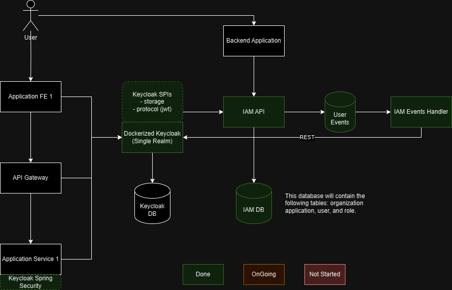
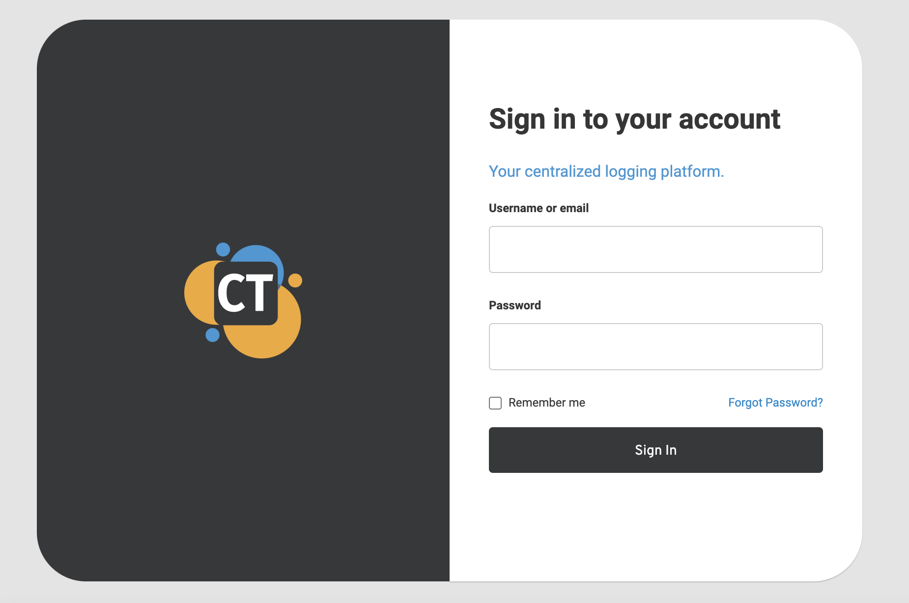
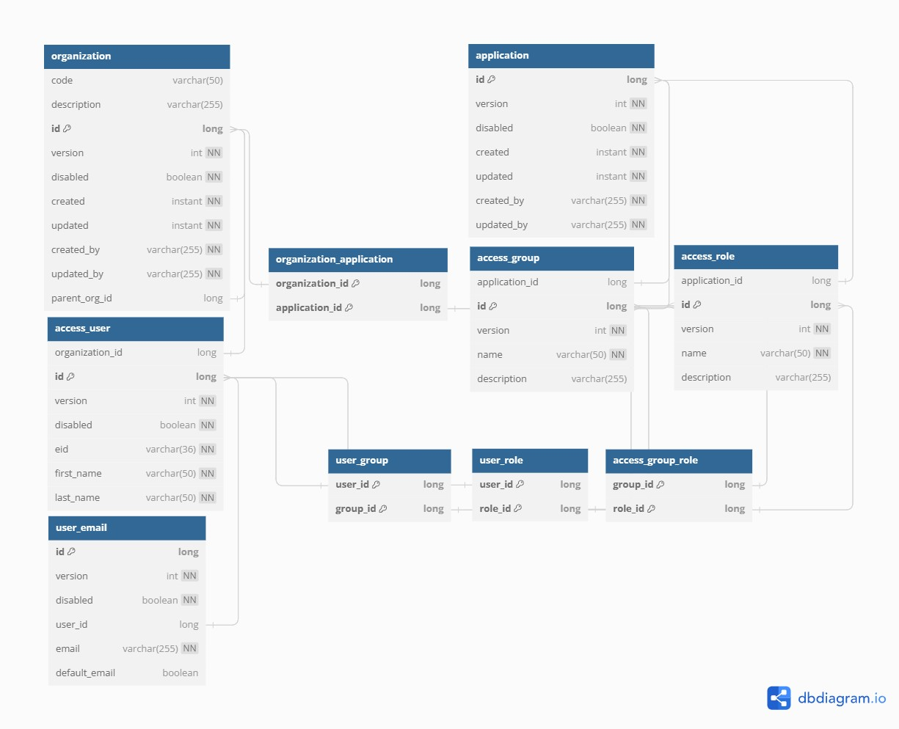

# Hivemaster IAM

This component plays a vital role within the Hivemaster module, which is a tailored Keycloak
application meticulously designed to address intricate authentication and authorization
requirements. These requirements encompass a range of complex scenarios, including multi-tenancy
setups, multi-application ecosystems, and n-level reseller structures, among others.

In the context of multi-tenancy, the Hivemaster module ensures that user authentication and
authorization processes remain distinct and secure for each tenant or organization utilizing the
system. This capability is essential for safeguarding sensitive data and access controls in a shared
environment.

Similarly, in multi-application scenarios, the module provides a cohesive solution for managing
authentication and authorization across various interconnected applications. This ensures seamless
user experiences while maintaining stringent security standards.

Moreover, the support for n-level reseller structures is a testament to the module's adaptability.
It empowers organizations with intricate distribution models to efficiently manage authentication
and authorization throughout their reseller network, ensuring that the right access is granted to
the right individuals or entities at every level.

In essence, the Hivemaster module serves as a versatile and indispensable component, addressing the
unique challenges posed by these diverse authentication and authorization scenarios, all while
upholding robust security and user experience standards.

`Conceptual Diagram`

## Versions

This project is running on:

- Keycloak 22.0.1
- MySQL JDBC Driver 8.0.29

## Features

### Custom login page

A custom theme "czetsuyatech" is configured when you run the container.

The theme is available at keycloak-docker-assembly/src/main/resources/themes/czetsuyatech and can
easily be overriden.

### Multi-Tenancy, N-reseller Level, and Multi-Application

This module supports:

- multi-tenancy - can support multi-organizations each with its own access level to applications and
  a different set of users
- multi-applications - an organization can have access to multiple applications
- n-level reseller - an organization can sell services to sub-organizations

## WIKI

- [Development Guide](docs/development.md)
- [Production Guide](docs/production.md)
- [Troubleshooting Guide](docs/troubleshooting-guide.md)
